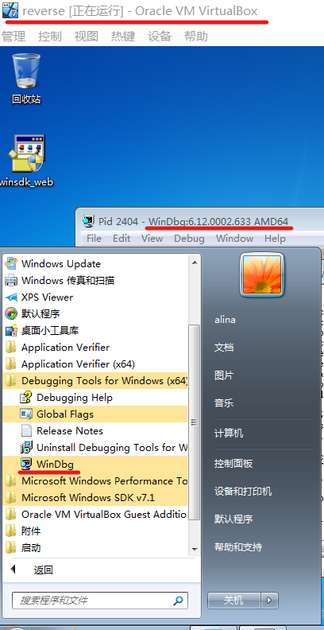
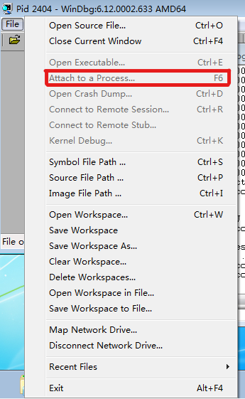
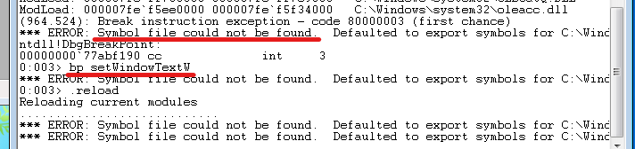
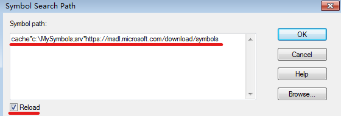
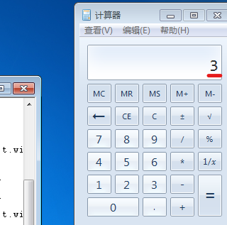
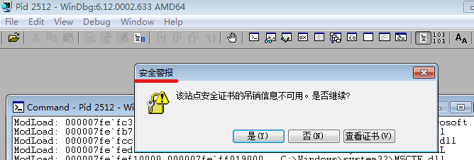

# 逆向工程与软件安全实验报告  
## WinDbg相关  
### 篡改计算器实现`1+1=3`  
#### 实验环境  
* VirtualBox  
* Windows 7  
* WinDbg x64  

(Windows 10一直无法实现篡改，改为Windows 7和老师实验环境保持一致)  

#### 实验过程  
在虚拟机中安装Windows7系统及WinDbg功能  
  
打开计算器程序，通过`Attach to a Process`实现连接  
  
根据[官网](https://docs.microsoft.com/en-us/windows-hardware/drivers/debugger/symbol-path)更改`Symbol Path`  
  
  
下断点调试  
```
bp User32!SetWindowTextW "du [rbp];g"
g
```  
实现篡改`1+1=3`的语句  
```
bp User32!SetWindowTextW ".if(poi(rbp)==32h){eb [rbp] 33h;gc}.else{du [rbp];gc}"
g
```  
  

#### 问题与解决  
1. 环境安装  
Windows 10 多次尝试没有结果，重新在虚拟机中搭建Windows 7 的环境，安装增强功能，建立共享文件夹(最难的不是做实验，而是要先学会搭好环境:joy:)  
2. Windows 7安全警告  
  
解决方案：开始以为是防火墙的原因，于是手动关闭防火墙，但仍然还是弹出安全警报，手动选择`是`来继续执行  

##### 参考资料  
[逆向工程与软件安全 2020年课程](http://vlab.cuc.edu.cn/student/#/course/89)  

