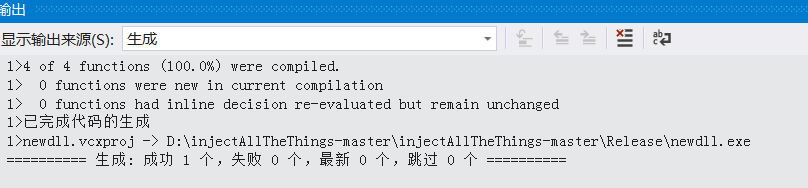

# 逆向工程与软件安全实验报告  
## 代码注入相关  
### 实验要求  
 - [x] 参照示例代码，编写dll文件，实现dll注入  

### 实验过程  
##### 编写dll  

1. 查看[示例代码](https://github.com/fdiskyou/injectAllTheThings)  
2. 在dllpoc项目下修改`dllpoc.cpp`  
    ```
    #include <windows.h>
    #include <stdio.h>

    BOOL APIENTRY DllMain(HMODULE hModule, DWORD  ul_reason_for_call, LPVOID lpReserved)
    {
        switch (ul_reason_for_call)
        {
        case DLL_PROCESS_ATTACH:
            break;
        case DLL_PROCESS_DETACH:
            break;
        case DLL_THREAD_ATTACH:
            break;
        case DLL_THREAD_DETACH:
            break;
        }
        return TRUE;
    }


    extern "C" __declspec(dllexport) BOOL cuc() {
        MessageBox(NULL, L"CUC is called!", L"Inject All The Things!", 0);

        TCHAR szExePath[MAX_PATH], szInfo[MAX_PATH + 100];

        GetModuleFileName(NULL, szExePath, MAX_PATH);

        printf("I'm Process %d", GetCurrentProcessId());

    #ifdef UNICODE
        char const* format = "%ls";
    #else 
        char const* format = "%s";
    #endif
        printf(format, szExePath);

        MessageBox(NULL, szExePath, L"Inject All The Things!", 0);

        return TRUE;
    }
    ```  
    生成结果  
      
3. 在项目中新建`load.c`调用`dllpoc.dll`  
  
    ```
    //load.c
    #include <Windows.h>
    #include <stdio.h>

    typedef BOOL(*CUC_PROC_ADDR)();

    int main() {
        HMODULE hMoudle = LoadLibraryA("dllpoc.dll");
        CUC_PROC_ADDR cuc_ptr = (CUC_PROC_ADDR)GetProcAddress(hMoudle, "cuc");
        void* cuc = GetProcAddress(hMoudle, "cuc");
        printf("CUC's pos: %p\n", cuc);
        cuc_ptr();
    }
    ```  
4. 成功调用  
  
5. 输出进程号  
  
6. 任务管理器证明  
  

##### 实现dll注入  
通过调用`injectAllTheThings.exe`实现将生成dll注入`notepad.exe`  
注：**要根据目标程序更改dll生成**  
例如`notepad.exe`程序为64位，在加载dll时要注意改为64位，不然会出现报错  
  

1. 在主机中打开`notepad.exe`程序，为注入创造条件  
  
2. 根据提示运行`injectAllTheThings.exe`实现dll注入  
`injectAllTheThings.exe -t 1 notepad.exe D:\injectAllTheThings-master\injectAllTheThings-master\x64\Release\dllmain.dll`  
  
3. 弹窗证明  
  


