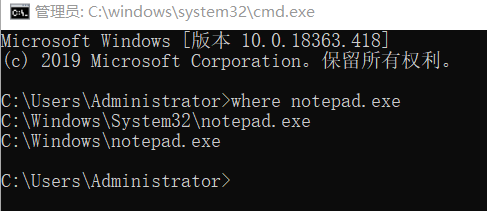
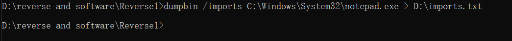
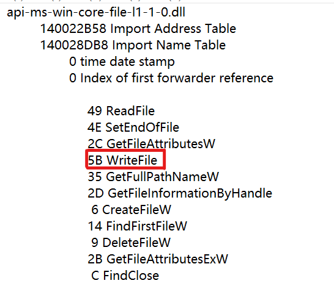
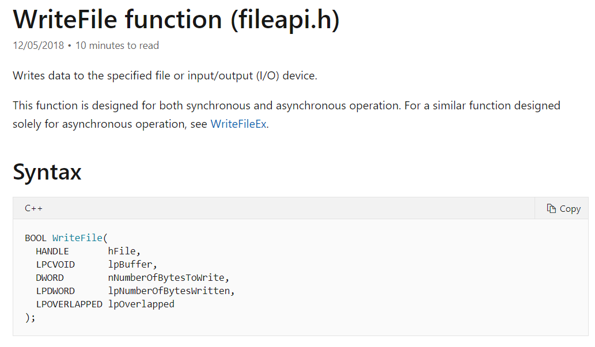
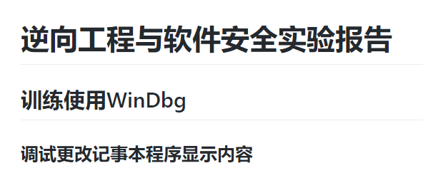
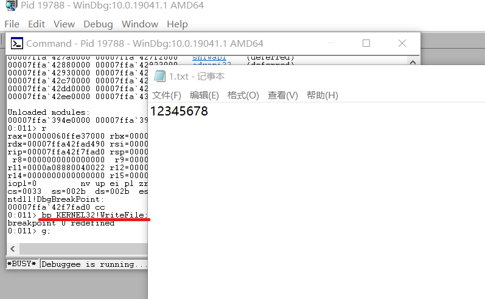
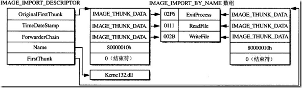
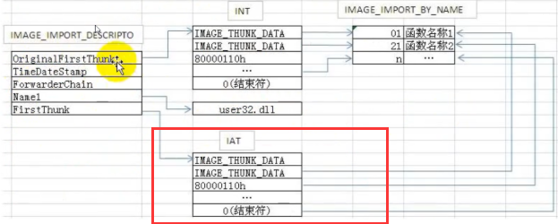
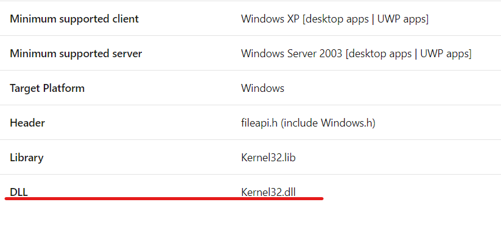

# 逆向工程与软件安全实验报告  
## 期末大作业  
### API hook方法更改notepad保存内容  
#### 实验环境  
* Windows 10  
* notepad.exe  
* Visual Studio 2019  
* WinDbg x64  

#### 实验要求  
 - [x] WinDbg实现篡改  
 - [ ] IAT hook方法实现篡改  
 
#### 实验过程  
1. 查看`notepad.exe`系统位置  
  
2. 查看`notepad.exe`导入表  
`dumpbin /imports C:\Windows\System32\notepad.exe > D:\imports.txt`  
  
3. 在导入表中查找与保存内容有关的函数  
在`kernel32.dll`中用到`WriteFile`  
  
4. 查找`WriteFile`函数相关文档  
[WriteFile function](https://docs.microsoft.com/en-us/windows/win32/api/fileapi/nf-fileapi-writefile)  
  
5. WinDbg尝试篡改确认函数功能  
[训练使用WinDbg](https://github.com/AlinaZxy/Reverse/blob/%E6%9C%9F%E6%9C%AB%E5%A4%A7%E4%BD%9C%E4%B8%9A/%E6%9C%9F%E6%9C%AB%E5%A4%A7%E4%BD%9C%E4%B8%9A/%E5%AE%9E%E9%AA%8C%E5%87%86%E5%A4%87/%E5%AE%9E%E9%AA%8C%E5%87%86%E5%A4%87.md)  
  
  
6. 理解IAT hook  
[参考代码](https://github.com/tinysec/iathook)  
基本来说就是通过hook的方式接触到api函数的入口点，通过改变它的地址指向新的自定义的函数来实现篡改  
IAT hook属于API hook中常见的一种，基于修改PE文件的导入表（IAT）实现  
  
如图，我们需要修改PE文件中IAT里保存函数地址的部分  
  
（我的理解）IAT hook实现过程：  
编写对应的dll，dll里面即可实现对目标注入程序ImageBase以及各种头(DOS,NT,FILE,OPT)的获取，然后用dll注入的方法实现以假乱真，即用假函数的指针替换原来表中真函数的指针。  
7. 修改代码实现IAT hook

#### 问题与解决  
1. 查看导入表认为是`api-ms-win-core-file-l1-1-0.dll`  
解决方案：在查阅官方文档时发现是`kernel32.dll`  
  
2. 在`API hook`和`IAT hook`中陷入纠结，思考二者有何区别  
解决方案：通过查阅资料发现，`IAT hook`其实是`API hook`的一种实现方法，IAT 法就是通过修改 IAT 表中的函数地址而达到的 API 截获的方法  
[API HOOK的 IAT方法](https://blog.csdn.net/misterliwei/article/details/840983)  

##### 参考资料  
[IAT HOOK](https://blog.csdn.net/enjoy5512/article/details/51570116)  
[IATHOOK详细讲解](http://www.gyarmy.com/post-393.html)  
[tinysec/iathook](https://github.com/tinysec/iathook)  
