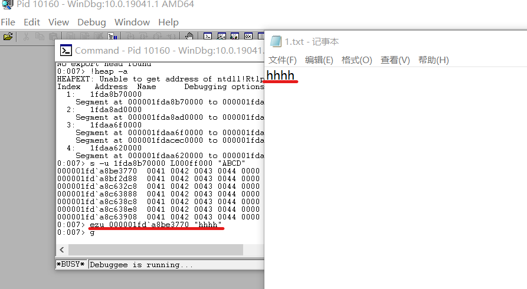

# 逆向工程与软件安全实验报告  
## 训练使用WinDbg  
### 调试更改记事本程序显示内容  
#### 实验环境  
* Windows 10  
* WinDbg x64  
* notepad.exe  

#### 实验过程  
1. 手动保存`1.txt`，内容为`ABCD`，用记事本程序打开  
  
2. 打开WinDbg，`Attach to a Process`到`notepad.exe`  
  
3. `!heap -a`查看堆中全部内容  
  
4. `s -u 1fda8b70000 L000ff000 "ABCD"`在内存中查找`ABCD`字符串  
  
5. 修改对应位置字符串内容，并继续调试  
    ```
    >ezu 000001fd`a8be3770 "hhhh"
    >g
    ```  
      

6. 更改显示内容成功！
